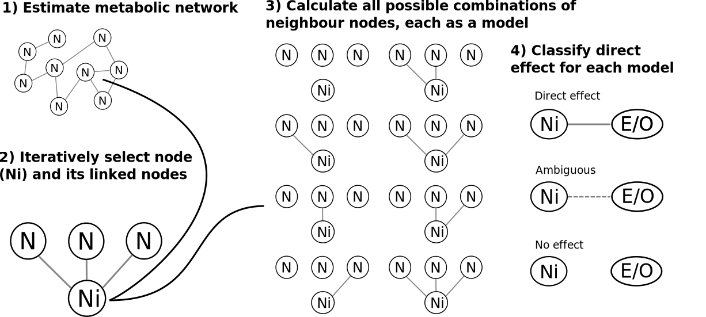
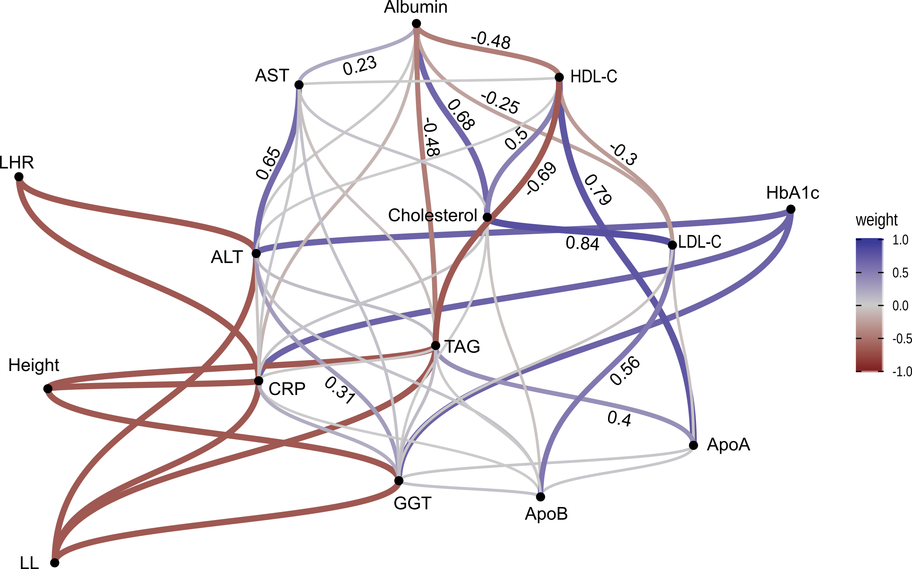

```{r setup, include=FALSE}
poster_title <- 
    "The Metabolic Pathways Between Components of Stature and HbA1c: A Causal Structure Learning Approach in the UK Biobank"

# Set some options and text by output
image_dpi <- 200

col_width <- function(px) {
    paste0("{data-width=", px, "}")
}

row_height <- function(px) {
    paste0("{data-height=", px, "}")
}

knitr::opts_chunk$set(
  echo = FALSE,
  dev = "svg",
  dpi = image_dpi,
  comment = "#>",
  message = FALSE,
  warning = FALSE
)
```

Column `r col_width('30%')`
-----------------------------------------------------------------------

### `r row_height('20%')`

#### **`r poster_title`**

| Luke W Johnston^1^, Clemens Wittenbecher^3^, Helene T Vistisen^2^, Christina C Dahm^2^, Daniel R Witte^1,2^
| 1. *Steno Diabetes Center Aarhus, Denmark*, 2. *Aarhus University, Denmark*, 3. *Harvard University, USA*

**No relevant disclosures**.

<hr>

<table style="width:100%">
<tr><td width="45%" align="left">
**Contact**:  
Luke W. Johnston, MSc, PhD  
Email: luke.johnston@rm.dk  
`r lwj::orcid_icon_html()`  
[posters.lwjohnst.com/2020/easd](https://posters.lwjohnst.com/2020/easd/)  
`r lwj::ccby_icon_html()`  
</td>
<td width="45%" align="center">
{width=75px}
{width=75px}
<br>
<br>
{width=60px}
</td></tr>
</table>

<hr>

<table style="width:100%">
<tr><td width="45%">

**Background**:

- Short adult leg length (LL) is a marker of adverse early childhood conditions
and is associated with higher risk for type 2 diabetes, but it's not known how
this association is metabolically mediated.
- *Aim*: Identify how components of stature influence metabolic profile
and HbA1c.

**Methods**:

- Cross-sectional analysis of UK Biobank (Application ID 47673): n=367,838,
without prevalent diabetes cases.
- Applied causal structure learning algorithm NetCoupler
(R package at [github.com/NetCoupler](https://github.com/NetCoupler/NetCoupler)),
tested on 100 resamples of 10% of dataset.
- Exposures: LL, leg-height ratio (LHR), and height; Outcome: HbA1c.
- Metabolic profile: gamma-glutamyltransferase (GGT), alanine aminotransferase
(ALT), aspartate aminotransferase (AST), TAG, LDL-C, HDL-C, total cholesterol,
C-reactive protein (CRP), apolipoprotein A and B, and albumin.
- Confounders: Age, sex, and waist circumference.

</td>
<td width="45%">

**Results**:

- Metabolic network links: e.g. HDL-C-LDL-C-Cholesterol-TAG (serum lipid profile)
and GGT-ALT-AST (liver function).
- Network to HbA1c: Positive links with ALT, GGT, and CRP.
- Stature to network: Negative links between: 
    - LL and height on CRP, GGT, and TAG.
    - LHR, LL on CRP and ALT.
- NetCoupler algorithm identified GGT, ALT, and CRP as likely metabolic link
between stature components and HbA1c.

**Conclusion**:

- Adverse early childhood growth conditions (leading to shorter
legs and shorter stature) may contribute to higher HbA1c through higher liver dysfunction (GGT and ALT) and higher inflammation
(CRP).

</td></tr>
</table>

Column `r col_width('70%')`
-----------------------------------------------------------------------

### Figure 1: NetCoupler algorithm (R package at [github.com/NetCoupler](https://github.com/NetCoupler)) process, identifies potential pathways between exposure (E), metabolic network (N), and outcome (O) `r row_height(375)`

```{r img-netcoupler}

```

### Figure 2: Pathways between stature, network, and HbA1c `r row_height(625)`

```{r}
fig_caption <- "Potential pathways identified from the NetCoupler algorithm. A darker blue link indicates a positive relationship, while a darker red one indicates a negative relationship. Grey lines between metabolic variables are the derived neighbours, but with weaker connections. Numbers between metabolic variables indicate the weights for the strong links (a larger number suggests a stronger link). Links shown with the stature or HbA1c variables and the network variables were classified as direct effect links; while all other connections with metabolic variables had been classified as ambiguous, they were removed for better visual presentation."
```

```{r img-outcome-side, fig.cap=fig_caption}

```

<!--
Script:

~ 125 words/minute * 3 minutes = 375 words
~ 150 words/minute * 4 minutes = 600 words

Hi everyone, thanks for listening in. I'll be presenting some results of using a
causal structure learning algorithm to investigate potential metabolic pathways
between the components of stature and HbA1c.

So, there is strong evidence of a relationship between adverse early life
conditions and risk for type 2 diabetes, but it isn't well-studied in humans how
this association may be mediated metabolically. So, using the UK Biobank
Cohort, we studied how adult leg length, used as a marker of early childhood
conditions, may influence type 2 diabetes risk with HbA1c through a standard
metabolic variables.

For this aim, my colleague Clemens developed a statistical method called
NetCoupler that could identify pathways in a metabolic network and analyze how
an exposure may influence this network and how this network may then influence
an outcome. Both myself and Clemens are developing NetCoupler as an R package
for wider use and more details about it are in the link shown on the poster.

So, briefly, NetCoupler works in four phases, as shown in Figure 1: First, it
estimates connections between metabolic variables, called nodes, and constructs a
network. Two, it extracts each node iteratively along with its linked
neighbouring nodes. Three, it calculates all possible combinations of these
neighbouring nodes with the index node and sets each as a model. So with
3 neighbours, that is 8 models. It then runs each model with the exposure or
outcome on the index node, adjusting for confounders like age, sex, and waist
circumference. Finally, based on the model results, it classifies using some
criteria whether the link is direct, ambiguous, or non-existent.

The nice thing about NetCoupler is that the results can be very nicely represented
visually, as shown in figure 2. Each dot is a variable, the darker blue lines
indicate a positive link between nodes, a darker red is a negative link, and the
numbers are the weights between the network variables.

There's a lot going on, so I'll highlight the top portion, where the variables
HDL, LDL, cholesterol, and TAG which is in the middle are all strongly linked
together, which is as we would expect. Likewise, liver function variables,
at the bottom and middle left, like ALT, AST, and GGT are all linked.

On the left side are the stature components, including leg to height ratio,
where we identified direct negative links with ALT, GGT, TAG, and CRP. On the
right side with HbA1c, we found direct positive links with ALT, CRP, and GGT. So
from these results, we can infer that lower stature components, including lower
relative leg length, may contribute to higher HbA1c through higher ALT, CRP, and
GGT.

To conclude, these results suggest that adverse early childhood conditions may
contribute to risk for type 2 diabetes through higher liver dysfunction and
through higher systemic inflammation. Thank you for listening and I look forward
to any questions.

-->
